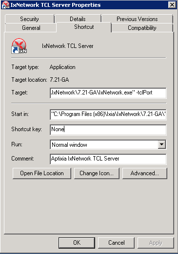

# Getting Started with 'vsperf'

## Hardware Requirements
VSPERF requires the following hardware to run tests: IXIA traffic generator (IxNetwork), a machine that runs the IXIA client software and a CentOS Linux release 7.1.1503 (Core) host.

## vSwitch Requirements
The vSwitch must support Open Flow 1.3 or greater.

## Installation

Follow the [installation instructions] to install.

## IXIA Setup
###On the CentOS 7 system
You need to install IxNetworkTclClient$(VER_NUM)Linux.bin.tgz.

### On the IXIA client software system
Find the IxNetwork TCL server app (start -> All Programs -> IXIA -> IxNetwork -> IxNetwork_$(VER_NUM) -> IxNetwork TCL Server)
  - Right click on IxNetwork TCL Server, select properties
  - Under shortcut tab in the Target dialogue box make sure there is the argument "-tclport xxxx" where xxxx is your port number (take note of this port number you will need it for the 10_custom.conf file).
  
  - Hit Ok and start the TCL server application

## Cloning and building src dependencies
In order to run VSPERF, you will need to download DPDK and OVS. You can do this manually and build them in a preferred location, or you could use vswitchperf/src. The vswitchperf/src directory contains makefiles that will allow you to clone and build the libraries that VSPERF depends on, such as DPDK and OVS. To clone and build simply:

```bash
cd src
make
```

VSPERF can be used with OVS without DPDK support. In this case you have to specify path to the kernel sources by WITH_LINUX parameter:

```bash
cd src
make WITH_LINUX=/lib/modules/`uname -r`/build
```

To build DPDK and OVS for PVP testing, use:

```bash
make VHOST_USER=y
```

To delete a src subdirectory and its contents to allow you to re-clone simply use:

```bash
make cleanse
```

## Configure the `./conf/10_custom.conf` file

The supplied `10_custom.conf` file must be modified, as it contains configuration items for which there are no reasonable default values.

The configuration items that can be added is not limited to the initial contents. Any configuration item mentioned in any .conf file in `./conf` directory can be added and that item will be overridden by the custom
configuration value.

## Using a custom settings file

Alternatively a custom settings file can be passed to `vsperf` via the `--conf-file` argument.

```bash
./vsperf --conf-file <path_to_settings_py> ...
```

Note that configuration passed in via the environment (`--load-env`) or via another command line argument will override both the default and your custom configuration files. This "priority hierarchy" can be described like so (1 = max priority):

1. Command line arguments
2. Environment variables
3. Configuration file(s)

---

## Executing tests
Before running any tests make sure you have root permissions by adding the following line to /etc/sudoers:
```
username ALL=(ALL)       NOPASSWD: ALL
```
username in the example above should be replaced with a real username.

To list the available tests:

```bash
./vsperf --list-tests
```

To run a group of tests, for example all tests with a name containing
'RFC2544':

```bash
./vsperf --conf-file=user_settings.py --tests="RFC2544"
```

To run all tests:

```bash
./vsperf --conf-file=user_settings.py
```

Some tests allow for configurable parameters, including test duration (in
seconds) as well as packet sizes (in bytes).

```bash
./vsperf --conf-file user_settings.py
    --tests RFC2544Tput
    --test-param "rfc2544_duration=10;packet_sizes=128"
```

For all available options, check out the help dialog:

```bash
./vsperf --help
```

---

[installation instructions]: installation.md

