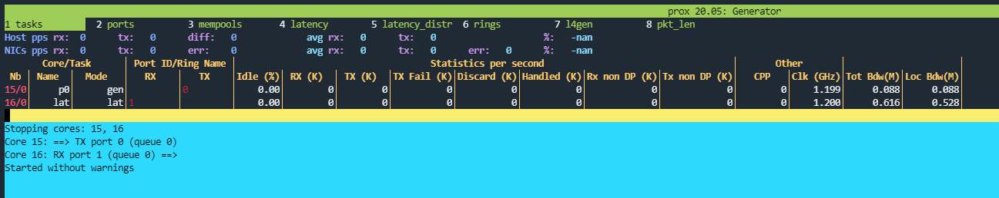
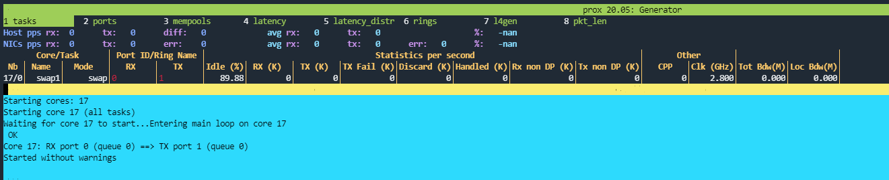

# ETSI GS NFV-TST 009 Testing with PROX and OvS-DPDK in a Kubernetes Cluster

This document shows an example of testing the dataplane in the third topology represented in the [topologies description](Topologies.md) with two pods equipped with two interfaces each that are bounded to OvS-DPDK, using PROX as traffic generator. The `userspace-rapid-pod-t3-p1.yaml` and the `userspace-rapid-pod-t3-p2.yaml` files can be created by modifying the [Rapid pod definition file](./Configuration/Kubernetes/Rapid-pod/userspace-rapid-pod-2-interfaces-OvS-DPDK.yaml).

### Prepare OvS-DPDK and deploy the kubernetes components

- On Node 1:
  - source vsperfenv/bin/activate
  2. cd vineperf.

  3. ./vsperf --conf-file ~/conf/vsperf-master.conf --mode trafficgen-off phy2phy_tput - Leave this window untouched.
- On Node 2 **(After previous steps)**:
  - Deploy network attachment `userspace-ovs-netAttach.yaml`
  - Deploy pods applying `userspace-rapid-pod-t3-p1.yaml` and `userspace-rapid-pod-t3-p2.yaml`

### Configure PROX inside the pods

- Generator Pod:

  - Enter the generator pod with `kubectl exec -it userspace-rapid-pod-t3-p1 -- /bin/bash`

  - copy the prox folder (it is shared between pods) to make changes on configuration files: `cp -r /opt/prox /opt/proxgen`

  - search for the two memif socketfile names running :

    ```
    [root@userspace-rapid-pod-t3-p1 /]# cat /etc/podnetinfo/annotations | grep socketfile
    userspace/configuration-data="[{\n    \"containerId\": \"87042916ab4dac68611ea9d2f02bcf26bc82b5d17716ffa9ebff1cf36af1fca3\",\n    \"ifName\": \"net1\",\n    \"name\": \"userspace-ovs-net-1\",\n    \"config\": {\n        \"engine\": \"ovs-dpdk\",\n        \"iftype\": \"vhostuser\",\n        \"netType\": \"interface\",\n        \"memif\": {},\n        \"vhost\": {\n            \"mode\": \"client\",\n            \"socketfile\": \"87042916ab4d-net1\"\n        },\n        \"bridge\": {}\n    },\n    \"ipResult\": {\n        \"interfaces\": [\n            {\n                \"name\": \"net1\",\n                \"sandbox\": \"/proc/2910/ns/net\"\n            }\n        ],\n        \"dns\": {}\n    }\n},{\n    \"containerId\": \"87042916ab4dac68611ea9d2f02bcf26bc82b5d17716ffa9ebff1cf36af1fca3\",\n    \"ifName\": \"net2\",\n    \"name\": \"userspace-ovs-net-1\",\n    \"config\": {\n        \"engine\": \"ovs-dpdk\",\n        \"iftype\": \"vhostuser\",\n        \"netType\": \"interface\",\n        \"memif\": {},\n        \"vhost\": {\n            \"mode\": \"client\",\n            \"socketfile\": \"87042916ab4d-net2\"\n        },\n        \"bridge\": {}\n    },\n    \"ipResult\": {\n        \"interfaces\": [\n            {\n                \"name\": \"net2\",\n                \"sandbox\": \"/proc/2910/ns/net\"\n            }\n        ],\n        \"dns\": {}\n    }\n}]"
    ```


  - copy the names `*-net1` and `*-net2`

  - edit the `parameters.lua` changing the socketfile name and set the CPUs number for the main core, generator cores and latency cores:

    ```lua
    ...
    eal="--socket-mem=256,0 --vdev=virtio_user0,path=/usrspcni/87042916ab4d-net1 --vdev=virtio_user1,path=/usrspcni/87042916ab4d-net2"
    mcore="14"
    ...
    gencores="15"
    latcores="16"
    ...

    ```

  - edit `prox.cfg` to configure the tasks properly for generating and receiving packets:

    ```
    [lua]
    dofile("parameters.lua")

    [eal options]
    -n=4 ; force number of memory channels
    no-output=no ; disable DPDK debug output
    eal=--proc-type auto ${eal}

    [port 0]
    name=p0
    rx desc=2048
    tx desc=2048
    vlan=yes
    lsc=no

    [port 1]
    name=p1
    rx desc=2048
    tx desc=2048
    vlan=yes
    lsc=no

    [variables]
    $mbs=8

    [defaults]
    mempool size=8K

    [global]
    name=${name}
    heartbeat timeout=${heartbeat}

    [core $mcore]
    mode=master

    [core $gencores]
    name=p0
    task=0
    mode=gen
    tx port=p0
    bps=1250000000
    pkt inline=${dest_hex_mac1} 00 00 00 00 00 00 08 00 45 00 00 2e 00 01 00 00 40 11 f7 7d ${local_hex_ip1} ${local_hex_ip2} 0b b8 0b b9 00 1a 55 7b
    pkt size=60
    min bulk size=$mbs
    max bulk size=16
    drop=yes
    lat pos=42
    accuracy pos=46
    packet id pos=50
    signature=0x98765432
    signature pos=56

    [core $latcores]
    name=lat
    task=0
    mode=lat
    rx port=p1
    lat pos=42
    accuracy pos=46
    packet id pos=50
    signature=0x98765432
    signature pos=56
    accuracy limit nsec=1000000
    latency bucket size=${bucket_size_exp}
    ```

  - Enter rapid folder and start PROX:

    ```
    [root@userspace-rapid-pod-t3-p1 /]# cd /opt/rapid/
    [root@userspace-rapid-pod-t3-p1 rapid]# ./prox -f ../proxgen/prox.cfg -et
    ```

    ```
    Usage: ./prox [-f CONFIG_FILE] [-a|-e] [-m|-s|-i] [-w DEF] [-u] [-t]
            -f CONFIG_FILE : configuration file to load, ./prox.cfg by default
            -e : don't autostart
            -t : Listen on TCP port 8474
    ```

    

- Swap Pod:

  - Enter the generator pod with `kubectl exec -it userspace-rapid-pod-t3-p2 -- /bin/bash`

  - copy the prox folder (it is shared between pods) to make changes on configuration files: `cp -r /opt/prox /opt/proxswap`

  - search for the two virtio socketfile names like for the Generator Pod and copy the names `*-net1` and `*-net2`

  - edit the `parameters.lua` changing the socketfile name and set the CPUs number for the main core (same as Generator Pod) and the swap cores:

    ```lua
    ...
    swapone="17"
    ...

    ```

  - edit `prox.cfg` to configure the tasks properly for swapping:

    ```
    [lua]
    dofile("parameters.lua")

    [eal options]
    -n=4 ; force number of memory channels
    no-output=no ; disable DPDK debug output
    eal=--proc-type auto ${eal}

    [port 0]
    name=p0
    rx desc=2048
    tx desc=2048
    vlan=yes
    lsc=no

    [port 1]
    name=p1
    rx desc=2048
    tx desc=2048
    vlan=yes
    lsc=no

    [variables]
    $mbs=8

    [defaults]
    mempool size=8K

    [global]
    name=${name}
    heartbeat timeout=${heartbeat}

    [core $mcore]
    mode=master

    [core $swapone]
    name=swap1
    task=0
    mode=swap
    rx port=p0
    tx port=p1
    drop=no
    ```

    - Enter rapid folder and start PROX:

      ```
      [root@userspace-rapid-pod-t3-p2 /]# cd /opt/rapid/
      [root@userspace-rapid-pod-t3-p2 rapid]# ./prox -f ../proxgen/prox.cfg
      ```

      

### Configure OVS-DPDK

The default configuration is under `vineperf/conf/02_vswitch.conf`. Then it's necessary to configure the connections between the interfaces

- Go to the utilities folder `cd /home/opnfv/vineperf/src/ovs/ovs/utilities`

- Run `sudo ovs-vsctl -- --columns=name,ofport list Interface` : Note down the port numbers (`ofport`) mapping to the vhost interfaces.

  ```
  [opnfv@worker utilities]$ sudo ovs-vsctl -- --columns=name,ofport list Interface
  name                : "dpdk1"
  ofport              : -1

  name                : "87042916ab4d-net1"
  ofport              : 1

  name                : "dpdk0"
  ofport              : -1

  name                : "vsperf-br0"
  ofport              : 65534

  name                : "2d63b16eb7ac-net2"
  ofport              : 4

  name                : "87042916ab4d-net2"
  ofport              : 2

  name                : "2d63b16eb7ac-net1"
  ofport              : 3
  ```

  In this case `ofport` for the first pod are 1 and 2 and for the second are 3 and 4.

- Open `setup_flows.sh` file. Modify the `in_port=<>` and `action=output:<>` values to connect the interfaces:

  ``` bash
  sudo ovs-ofctl --timeout 10 -O OpenFlow13 del-flows vsperf-br0
  sudo ovs-ofctl --timeout 10 -O Openflow13 add-flow vsperf-br0 in_port=1,idle_timeout=0,action=output:3
  sudo ovs-ofctl --timeout 10 -O Openflow13 add-flow vsperf-br0 in_port=4,idle_timeout=0,action=output:2
  ```


- Run `sudo ./setup_flows.sh`

- Verify that the flows are correct by running `sudo ovs-ofctl dump-flows vsperf-br0`:

  ``` bash
  [opnfv@worker utilities]$ sudo ovs-ofctl dump-flows vsperf-br0
   cookie=0x0, duration=10.400s, table=0, n_packets=0, n_bytes=0, in_port=1 actions=output:3
   cookie=0x0, duration=10.348s, table=0, n_packets=0, n_bytes=0, in_port=4 actions=output:2
  ```


### Configure rapid environment and files

On Node 1 the environment and the file for running rapid should be set-up.

Source the rapidenv and enter the rapid folder:

```bash
[opnfv@worker ~]$ source rapidenv/bin/activate
(rapidenv) [opnfv@worker ~]$  cd rapid
(rapidenv) [opnfv@worker rapid]$
```

Now we need `.env` ,  `.tst` and `machine.map` files to run the `runrapid.py` script that do the tests.

Before creating theese files the IP of the generator pod is needed. On Node 1 run this command:

``` bash
[opnfv@master ~]$ kubectl get pods -o wide
NAME                        READY   STATUS    RESTARTS   AGE   IP             NODE     NOMINATED NODE   READINESS GATES
userspace-rapid-pod-t3-p1   1/1     Running   0          69m   10.244.1.157   worker   <none>           <none>
userspace-rapid-pod-t3-p2   1/1     Running   0          69m   10.244.1.158   worker   <none>           <none>
```

For the `topology-3.env`:

```
[rapid]
loglevel = DEBUG
version = 19.6.30
total_number_of_machines = 1

[M1]
name = rapid-pod-1
admin_ip = 10.244.1.157
dp_ip = 192.168.1.4
dp_mac = de:ad:c3:52:79:9b


[ssh]
key=rapid_rsa_key
user = root

[Varia]
vim = Openstack
stack = rapid
```

Before the `.tst` file, the `prox.cfg` file should be copied under a folder in the same Node, in this case under `~/configs`.

The `topology-3.tst`:

```
[TestParameters]
name = Rapid_ETSINFV_TST009
number_of_tests = 1
total_number_of_test_machines = 1
lat_percentile = 99

[TestM1]
name = Generator
prox_launch_exit = false
config_file = configs/prox.cfg
dest_vm = 1
mcore = [14]
gencores = [15]
latcores = [16]

[test1]
test=TST009test
warmupflowsize=128
warmupimix=[64]
warmupspeed=1
warmuptime=2
imixs=[[64],[128],[256],[512],[1024],[1280],[1512]]
flows=[1]
drop_rate_threshold = 0
MAXr = 3
MAXz = 5000
MAXFramesPerSecondAllIngress = 12000000
StepSize = 10000
```

For `machine.map`:

```
[DEFAULT]
machine_index=0

[TestM1]
machine_index=1

[TestM2]
machine_index=2

[TestM3]
machine_index=3

[TestM4]
machine_index=4
```


### Running the tests

Now that it's all configured, the test can be started form the rapid folder with the `runrapid.py` script, passing the two files as arguments:

``` bash
(rapidenv) [opnfv@worker rapid]$ python runrapid.py --env topology-3.env --test topology-3.tst  --map machine.map --runtime 10 --screenlog DEBUG
```

