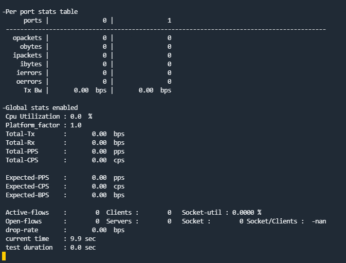

# ETSI GS NFV-TST 009 Testing with TRex and VPP in a Kubernetes Cluster

This document show an example of testing the dataplane in the third topology represented in the [topologies description](Topologies.md) with two pods equipped with two interfaces each that are bounded to VPP, using TRex as traffic generator. The `userspace-trex-pod-t3-p1.yaml` file can be created by modifying the [TRex pod definition file](./Configuration/Kubernetes/TRex-pod/userspace-trex-pod-2-interfaces-VPP.yaml) and for `userspace-rapid-pod-t3-p2.yaml`  file use the [Rapid pod definition file](./Configuration/Kubernetes/Rapid-pod/userspace-rapid-pod-2-interfaces-VPP.yaml).

### Prepare VPP and deploy the Kubernetes components

- On Node 1:
  - Start `vpp.service` with `startup.conf` file under `/etc/vpp`
- On Node 2:
  - Deploy network attachment `userspace-vpp-netAttach-memif.yaml`
  - Deploy pods applying `userspace-trex-pod-t3-p1.yaml` and `userspace-rapid-pod-t3-p2.yaml`

### Configure TRex inside the pods

- Generator Pod:

  - Enter the generator pod with `kubectl exec -it userspace-trex-pod-t3-p1 -- /bin/bash`

  - Run the script `vppconf.py` that generates the TRex configuration file:

    ```
    [root@userspace-trex-pod-t3-p1 ~]# python3 vppconf.py 
        Type=Memif  Role=slave  Mode=ethernet  Path=/usrspcni/memif-e80434cd91fc-net1.sock
        Type=Memif  Role=slave  Mode=ethernet  Path=/usrspcni/memif-e80434cd91fc-net2.sock
    ```

  - Edit the configuration file `/etc/trex_cfg.yaml` to set the slave mode for the memif interface :

    ```
    ...
      interfaces    : ["--vdev=net_memif0,socket=/usrspcni/memif-e80434cd91fc-net1.sock,role=slave", "--vdev=net_memif1,socket=/usrspcni/memif-e80434cd91fc-net2.sock,role=slave"]   # list of the interfaces
      ...
    ```

  - Go in the TRex folder and start it: 

    ```
    [root@userspace-trex-pod-t3-p1 ~]# cd v2.86/
    [root@userspace-trex-pod-t3-p1 v2.86]# ./t-rex-64 -i --no-scapy-server --nc --no-watchdog
    ```

    The TRex screen comes up: 

    

    

- Swap Pod:

  - Enter the generator pod with `kubectl exec -it userspace-rapid-pod-t3-p2 -- /bin/bash`

  - copy the prox folder (it is shared between pods) to make changes on configuration files: `cp -r /opt/prox /opt/proxswap`

  - search for the two memif socketfile names running :  

    ```bash
    [root@userspace-rapid-pod-t3-p2 /]# cat /etc/podnetinfo/annotations | grep socketfile
    userspace/configuration-data="[{\n    \"containerId\": \"fbbc9e8e1c5bfb280eeb061c7c1fc6fade8cb2e0e8cda7dd0c3974ce61442246\",\n    \"ifName\": \"net1\",\n    \"name\": \"userspace-vpp-net\",\n    \"config\": {\n        \"engine\": \"vpp\",\n        \"iftype\": \"memif\",\n        \"netType\": \"interface\",\n        \"memif\": {\n            \"role\": \"slave\",\n            \"mode\": \"ethernet\",\n            \"socketfile\": \"memif-fbbc9e8e1c5b-net1.sock\"\n        },\n        \"vhost\": {},\n        \"bridge\": {}\n    },\n    \"ipResult\": {\n        \"interfaces\": [\n            {\n                \"name\": \"net1\",\n                \"sandbox\": \"/proc/24281/ns/net\"\n            }\n        ],\n        \"dns\": {}\n    }\n},{\n    \"containerId\": \"fbbc9e8e1c5bfb280eeb061c7c1fc6fade8cb2e0e8cda7dd0c3974ce61442246\",\n    \"ifName\": \"net2\",\n    \"name\": \"userspace-vpp-net\",\n    \"config\": {\n        \"engine\": \"vpp\",\n        \"iftype\": \"memif\",\n        \"netType\": \"interface\",\n        \"memif\": {\n            \"role\": \"slave\",\n            \"mode\": \"ethernet\",\n            \"socketfile\": \"memif-fbbc9e8e1c5b-net2.sock\"\n        },\n        \"vhost\": {},\n        \"bridge\": {}\n    },\n    \"ipResult\": {\n        \"interfaces\": [\n            {\n                \"name\": \"net2\",\n                \"sandbox\": \"/proc/24281/ns/net\"\n            }\n        ],\n        \"dns\": {}\n    }\n}]"
    ```

    

  - copy the names `memif-*-net1.sock` and `memif-*-net2.sock`

  - edit the `parameters.lua` changing the socketfile name and set the CPUs number for the main core, generator cores and latency cores: 

    ```lua
    ...
    eal="--socket-mem=256,0 --vdev=net_memif0,socket=/usrspcni/memif-fbbc9e8e1c5b-net1.sock --vdev=net_memif1,socket=/usrspcni/memif-fbbc9e8e1c5b-net2.sock"
    mcore="14"
    ...
    swapone="17"
    ...
    ```

  - edit `prox.cfg` to configure the tasks properly for swapping:

    ```
    [lua]
    dofile("parameters.lua")                                                       
    
    [eal options] 
    -n=4 ; force number of memory channels
    no-output=no ; disable DPDK debug output 
    eal=--proc-type auto ${eal}
    
    [port 0]
    name=p0
    rx desc=2048
    tx desc=2048
    vlan=yes
    lsc=no                                                                         
    
    [port 1]
    name=p1
    rx desc=2048
    tx desc=2048
    vlan=yes
    lsc=no
    
    [variables]
    $mbs=8                                                                         
    
    [defaults]
    mempool size=8K
    
    [global]
    name=${name}
    heartbeat timeout=${heartbeat}
    
    [core $mcore]
    mode=master
    
    [core $swapone]
    name=swap1
    task=0
    mode=swap
    rx port=p0
    tx port=p1
    drop=no
    ```

    - Enter rapid folder and start PROX:

      ```bash
      [root@userspace-rapid-pod-t3-p2 /]# cd /opt/rapid/
      [root@userspace-rapid-pod-t3-p2 rapid]# ./prox -f ../proxgen/prox.cfg
      ```

      

### Configure VPP

On Node 1 VPP should be configured to send the traffic between memif interfaces with `l2patch`:

```
[opnfv@worker ~]$ sudo vppctl
    _______    _        _   _____  ___ 
 __/ __/ _ \  (_)__    | | / / _ \/ _ \
 _/ _// // / / / _ \   | |/ / ___/ ___/
 /_/ /____(_)_/\___/   |___/_/  /_/    

vpp# show interface 
              Name               Idx    State  MTU (L3/IP4/IP6/MPLS)     Counter          Count     
local0                            0     down          0/0/0/0       
memif1/0                          1      up          9000/0/0/0     
memif2/0                          2      up          9000/0/0/0     
memif3/0                          3      up          9000/0/0/0     
memif4/0                          4      up          9000/0/0/0     
vpp# show l2patch 
no l2patch entries
vpp# test l2patch rx memif1/0 tx memif3/0
vpp# test l2patch rx memif4/0 tx memif2/0
vpp# show l2patch                        
                  memif1/0 -> memif3/0
                  memif4/0 -> memif2/0
```

To check the socketfiles of the showed memif for the patch configuration run:

```
vpp# show memif 
sockets
  id  listener    filename
  2   yes (1)     /var/lib/cni/usrspcni/data/memif-e80434cd91fc-net2.sock
  4   yes (1)     /var/lib/cni/usrspcni/data/memif-fbbc9e8e1c5b-net2.sock
  3   yes (1)     /var/lib/cni/usrspcni/data/memif-fbbc9e8e1c5b-net1.sock
  0   no          /run/vpp/memif.sock
  1   yes (1)     /var/lib/cni/usrspcni/data/memif-e80434cd91fc-net1.sock
  
...
```

### Configure vsperf environment and files

On Node 1 the environment and the file for running rapid should be setted up.

Source the rapidenv and enter the rapid folder: 

```bash
[opnfv@worker ~]$ source vsperfenv/bin/activate
(rapidenv) [opnfv@worker ~]$  cd rapid
(rapidenv) [opnfv@worker rapid]$
```

Now edit the vsperf configuration file to use TRex with the test variables setted up and write the generator pod's IP for the connection. Find the IP with `kubectl get pods -o wide`:

```
[opnfv@master ~]$ kubectl get pods -o wide
NAME                        READY   STATUS    RESTARTS   AGE   IP             NODE     NOMINATED NODE   READINESS GATES
userspace-rapid-pod-t3-p2   1/1     Running   0          22m   10.244.1.203   worker   <none>           <none>
userspace-trex-pod-t3-p1    1/1     Running   0          22m   10.244.1.202   worker   <none>           <none>
```

Copy the IP of the `userspace-trex-pod-t3-p1` pod and then edit the configuration file `~/conf/vsperf-trex.conf`:

```
VSWITCH_BRIDGE_NAME = 'vsperf-br0'
WHITELIST_NICS = ['06:00.0', '06:00.1']
TRAFFICGEN = 'Trex'
TRAFFICGEN_TREX_HOST_IP_ADDR = '10.244.1.202'
TRAFFICGEN_TREX_USER = 'root'
TRAFFICGEN_TREX_BASE_DIR = '/root/v2.86/'
TRAFFICGEN_TREX_LINE_SPEED_GBPS = '10'
TRAFFICGEN_TREX_PORT1 = '0000:02:00.0'
TRAFFICGEN_TREX_PORT2 = '0000:02:00.1'
TRAFFICGEN_TREX_PROMISCUOUS = False
TRAFFICGEN_DURATION=10
TRAFFICGEN_LOSSRATE=0
TRAFFICGEN_RFC2544_TESTS=10
TRAFFICGEN_PKT_SIZES=(64,128,256,512,1024,1280,1518)
GUEST_TESTPMD_FWD_MODE = ['io']
GUEST_IMAGE = ['/home/opnfv/old/vnfs/vloop-vnf-ubuntu-18.04_20180920.qcow2']
TRAFFICGEN_TREX_LATENCY_PPS = 1000
TRAFFICGEN_TREX_FORCE_PORT_SPEED = True
TRAFFICGEN_TREX_PORT_SPEED = 10000 # 10 Gbps
TRAFFICGEN_TREX_RFC2544_BINARY_SEARCH_LOSS_VERIFICATION = True
TRAFFICGEN_TREX_RFC2544_MAX_REPEAT = 3
```

### Running the tests

Now that it's all configured, the test can be started form the vineperf folder with the `vsperf` script, passing the configuration file as argument:

``` bash
(vsperfenv) [opnfv@worker vineperf]$ ./vsperf --conf-file ~/conf/vsperf-trex.conf --mode trafficgen phy2phy_tput
```

