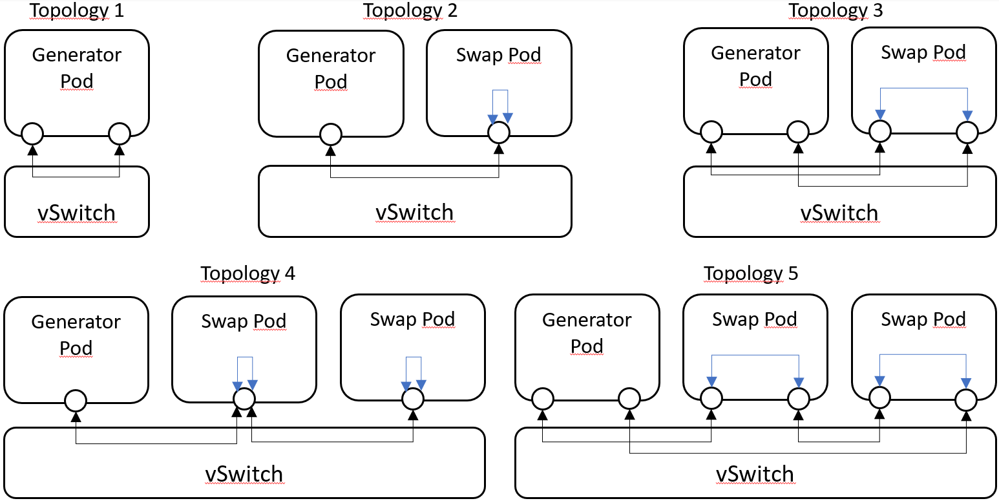

# Topologies used for East-Weast traffic benchmarking

For the East-Weast traffic benchmarking, five topologies has been tested. These topologies are composed by Pods running in the same node, and each one differs in terms of number of Pods and numbers of interfaces.

### Topologies

### Single and Multi Nodes

A System Under Test (SUT) can be composed by one or more nodes. In a single node configuration all the Pods run on the same worker node, while, in a multi node configuration there are Pods that run on different workers and the traffic flows also in the Kubernetes main network.

### Traffic Generators as PODs

##### Different Traffic generators

The traffic generators available as Pods are TRex and PROX.

##### Swaps and Routers as test-pods.

PROX's Swap and Router modes are useful for creating complex network topologies (such as the 5 shown at the beginning of this file).

- Swap: takes whatever arrives on a specified rx port and send to a specified tx port. The source/destination MAC and ports are swapped.
- Router: PROX defines a routing table to foward traffic on the Pod's interfaces. It finds MAC address by running the ARP protocol and than updates the table.

##### CNIs Used

The additional interfaces has been configured by the Userspace CNI. With that CNI the Pods can use memif or vhost-user interfaces to communicate respectively with VPP or OvS-DPDK.

SRIOV was excluded due to lack of access to switching infrastructure.